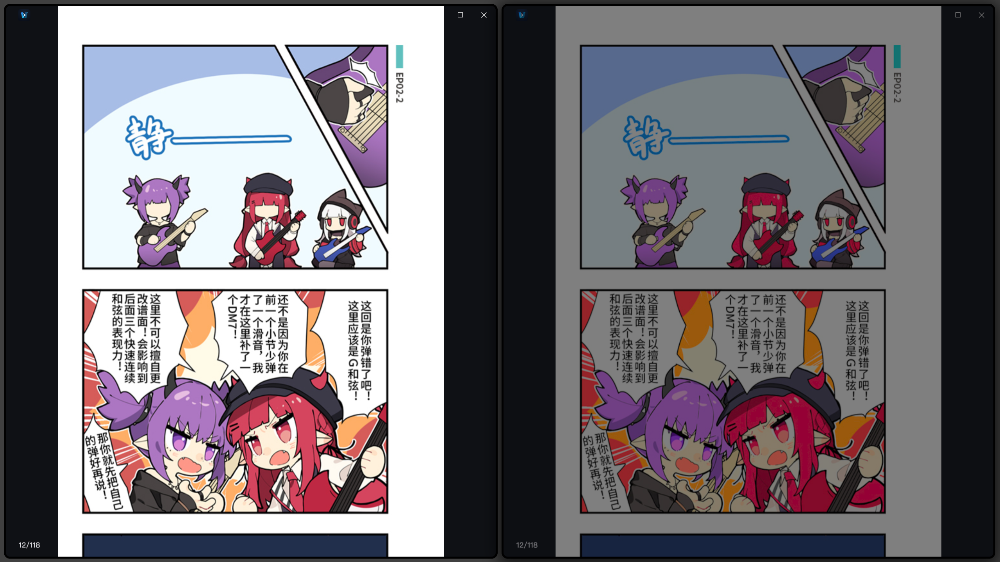
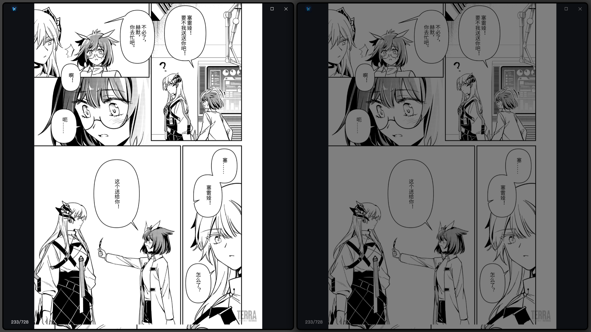

# niri (brightness-curve fork)

A fork of [niri](https://github.com/niri-wm/niri), the scrollable-tiling Wayland compositor, adding a per-window **brightness curve**. Everything described in the [upstream documentation](https://niri-wm.github.io/niri/) applies here as well.

## Feature: brightness curve

The `brightness-curve` window rule applies a custom tone curve to a window's Oklab lightness, preserving hue and mapping brightness perceptually uniformly. Saturated colors that no longer fit the sRGB gamut get their chroma reduced to fit. See the fork's [window rules documentation](docs/wiki/Configuration:-Window-Rules.md#brightness-curve) for the full details.




Above: the left column is the original comic, the right column is the same comic rendered through the curve `y = c*x / (c + (1-c)*x)` with `c=0.6`.

## Example Usage

Light-themed windows, such as comic or manga readers, can appear harsh against a dark-mode desktop. Applying a concave curve that caps the peak brightness while leaving the shadow end largely untouched would effectively soften the highlights without compromising dark detail.

```kdl
window-rule {
    match app-id="venera-next"
    // y = c*x / (c + (1-c)*x)
    brightness-curve {
        points 0 0 0.2 0.176 0.4 0.316 0.6 0.429 0.8 0.522 1.0 0.6 // c=0.6
        // points 0 0 0.2 0.181 0.4 0.329 0.6 0.453 0.8 0.559 1.0 0.65 // c=0.65
        // points 0 0 0.2 0.184 0.4 0.341 0.6 0.477 0.8 0.596 1.0 0.7 // c=0.7
        // points 0 0 0.2 0.188 0.4 0.353 0.6 0.5 0.8 0.632 1.0 0.75 // c=0.75
        // points 0 0 0.2 0.19 0.4 0.364 0.6 0.522 0.8 0.667 1.0 0.8 // c=0.8
    }
}
```

## Maintenance

This fork is maintained in my spare time. It is synced with upstream roughly once a month, so new upstream releases may take a while to land here. If you would like an update (for example, a newer upstream release or a fix) to land sooner, feel free to open an issue to ask for it — it will be picked up whenever I have some spare time.

## License

This project is distributed under the [GNU General Public License v3](LICENSE)
